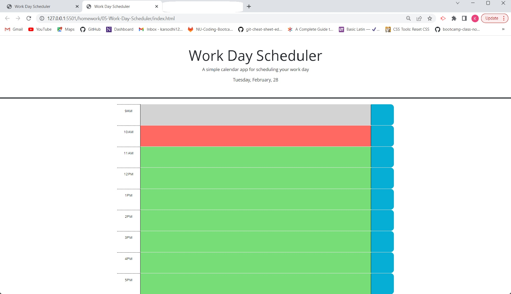

# 05-Work-Day-Scheduler
Work Day Scheduler

# 05-homework
This is the fifth homework assignment that we are tasked with.  We were work with a daily planner that displayed the date on top of the page.  It also displays the hours of the day where it shows grey if the hour has passed, green if the hours are still there, and red for the current hour.  We were also tasked with being able to create a task within the hour and it being saved to the tabs of time.

# Mentions
I worked with a tutor for this assignment through the tutoring session for help and guidance as well as the TA's help from class.

# Links
https://github.com/karsodhi/05-Work-Day-Scheduler

https://karsodhi.github.io/05-Work-Day-Scheduler/

# Screenshots
